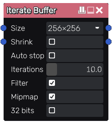

Iterate Buffer node
~~~~~~~~~~~~~~~~~~~

The **Iterate Buffer** node samples its input into a texture of a given resolution, applies
a "loop subgraph" several times and outputs the result.

Iterate buffers are used to apply a transform or filter several times to an input
image and can thus be used to implement filters that require multiple passes.

Inputs
++++++

The **Iterate Buffer** node has an initialization input that provies the base image,
and a loop input that provides the image transformed by a single pass.

Outputs
+++++++

The **Iterate Buffer** node has 2 outputs:

* the first output is the main output that provides the final result

* the second output is the loop output that provides the image for each iteration

Parameters
++++++++++

The **Iterate Buffer** node has two parameters:

* the *texture resolution*

* the *number of iterations* for the loop
