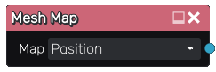

Mesh Map node
~~~~~~~~~~~~~

**Mesh Map** node bakes maps for the current custom mesh and recalculates
automatically when a new mesh is selected in the 3D preview.

Inputs
++++++

The **Mesh Map** node does not accept any input.

Outputs
+++++++

The **Mesh Map** node outputs the selected generated map, which can be the following:

* Position, Normal, Tangent, Minimum/Maximum Curvature, Cavity, Pointiness, Ambient Occulusion, Bent Normals, Thickness, Adjacency

Example Images
++++++++++++++

