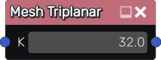
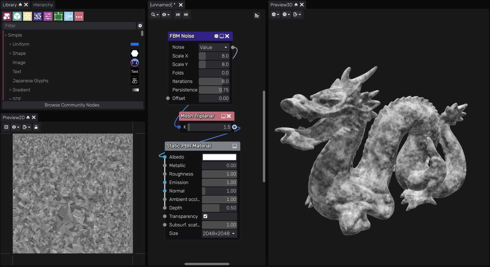

Mesh Triplanar node
~~~~~~~~~~~~~~~~~~~

The **Mesh Triplanar** node samples the input image three times and
projects them onto a model from orthogonal axes using position map
and blends them using surface normals generated from the Mesh Map node.

This makes it possible to texture a model without relying on proper UVs,
but the model must first be unwrapped.

Inputs
++++++

**Mesh Triplanar** node accepts an RGBA input.

Outputs
+++++++

**Mesh Triplanar** outputs a triplanar-mapped texture map which can be used on a custom model.

Parameters
++++++++++

**Mesh Triplanar** node has a single parameter *K* which defines the blending strength of the texture samples.

Example Images
++++++++++++++

