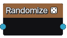

Randomize node
~~~~~~~~~~~~~~

The **Randomize** node can be used to take a set of color ids and generate a new set. 
This can be useful if more color ids are needed, or to localise randomization to indside
a node group.

Inputs
++++++

The **Randomize** node has a single input of color ids to be re-randomized.

Outputs
+++++++

The **Randomize** node has a single output of the randomized color ids.
