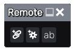

Remote node
~~~~~~~~~~~

The **Remote** node has no direct effect on the material but can be used to
control key parameters of the material to configure it easily.

When started, the Remote node only shows 3 buttons.

The left button can be used to create a linked control, that can be used to
mirror one or several similar parameters.
The middle button can be used to create a configuration control, that can be
associated to several parameters and store several named configurations for
those parameters.
The right button can be used to create a named parameters, that can be
used in expressions in other nodes parameters.

Controls and parameters can be renamed, reordered and deleted using the
Remote node user interface.

Linked control
++++++++++++++

When creating a Linked control (using the "Create linked control" button),
it is necessary to first pick a parameter in the material graph. The newly
created control will be a copy of the selected parameter control, and when
changing the value of the Linked control, the associated control will be
updated accordingly.

A Linked control can also be associated to other parameters, provided they
are of the same kind.

When hovering on the Linked control, Material Maker will show the parameters
it controls.

Configuration control
+++++++++++++++++++++

When creating a Configuration control (using the "Create configuration control"
button), it is necessary to first pick a parameter in the material graph.
The newly created control will hold a list of configurations of the associated
parameters.

A Linked control can be associated to other parameters, and it is recommended to
associate all relevant parameters before adding configurations.

When hovering on the Linked control, Material Maker will show the parameters
it controls.

To create a configuration, set all associated parameters to the desired values,
and select the **<add configuration>** entry in the drop-down list. Then enter a
name for this configuration, and it will be added to the list.

The drop-down list can be used to select a configuration, create new ones and
update or delete the current configuration.

Named parameters
++++++++++++++++

Named parameters are float parameters that can be used in expressions in all
float parameters of all nodes of the subgraph.

Named parameters in parameter expressions must be prefixed with a dollar
sign.
