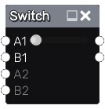

Switch node
~~~~~~~~~~~

The **Switch** node can be used to select sources for 2 to 5 output textures
from a choice of 2 to five inputs sets. It is useful to create variations
of a material and easily switch between them.

Inputs
++++++

The **Switch** node has from 2 to 25 color inputs A1, B1, .. D5, E5.

Outputs
+++++++

The **Switch** node has 2 to 5 outputs named A, B, C, D and E.

Parameters
++++++++++

The **Switch** node has a 3 parameters:

* the *number of outputs*

* the *number of choices*

* the *current choice*. For example, if the current chopice is 2, A will output
  the source image for A2, B will transmit B2...

When the node is not editable (use **Control-W** to switch from non editable to editable),
only the current choice can be modified.
