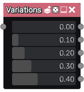

Variations node
~~~~~~~~~~~~~~~

The **Variations** node can be used to generate several variations of its input.

Inputs
++++++

The **Variations** node has a single input whose variations will be generated.

Outputs
+++++++

The **Variations** node has several outputs that generate different variations.

Note
++++

To generate variations, the **Variations** node rolls it input with different seeds.

The whole incoming branch is affected, until a buffer, text or image node is reached.
