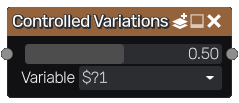

Controlled Variations node
~~~~~~~~~~~~~~~~~~~~~~~~~~

The **Controlled Variations** node can be used to generate several variations of its input.
Variations differ by the value of a variable (defined in the **Variable** parameter),
that can be used in parameter expressions of the input.

Inputs
++++++

The **Controlled Variations** node has a single input whose variations will be generated.

Outputs
+++++++

The **Controlled Variations** node is variadic and can several outputs that generate different variations.

Parameters
++++++++++

The **Controlled Variations** node accepts the following parameters:

* the *Value* selected for the variable for each output

* the *Variable* that is controlled by the node (**$?1**, **$?2**, **$?3** or **$?4**)

Note
++++

To generate variations, the **Controlled Variations** node sets different values of the variations
variable.

The whole incoming branch is affected, until a buffer, text or image node is reached.
