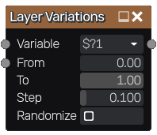

Layer Variations node
~~~~~~~~~~~~~~~~~~~~~

The **Layer Variations** node can be used to layer several variations of its input.
Variations differ by the value of a variable (defined in the **Variable** parameter),
that can is modified automatically according to the **From**, **To** and **Step**
parameters.

Inputs
++++++

The **Layer Variations** node has a grayscale input whose variations will be generated
and stacked, and a mask input that is applied to each layer.

Outputs
+++++++

The **Layer Variations** node has a single grayscale output that shows the layered variations.

Parameters
++++++++++

The **Layer Variations** node accepts the following parameters:

* *From*, the initial value of the variable

* *To*, the maximum value of the variable

* the *Step* used to loop through all values

* the *Variable* that is controlled by the node (**$?1**, **$?2**, **$?3** or **$?4**)

* the *Randomize* option, that sets different seeds for different variations

Note
++++

To generate variations, the **Layer Variations** node sets different values of the variations
variable.

The whole incoming branch is affected, until a buffer, text or image node is reached.
