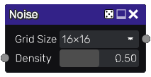

Noise node
~~~~~~~~~~

The **Noise** node outputs a randomly generated black and white texture.

Inputs
++++++

The **Noise** node accepts a single input, the **Density Input** to optionally
drive the **Density** value with an input.

Outputs
+++++++

The **Noise** node provides a black and white noise texture.

Parameters
++++++++++

The **Noise** node accepts the following parameters:

* *Grid size* is the number of rows and columns in the texture.

* *Density* is the likelihood for each cell to be white.

Notes
+++++

Although this node has a grid size, it generates a resolution independant texture.

Example images
++++++++++++++

.. image:: images/node_noise_samples.png
	:align: center
