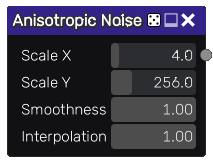

Anisotropic noise node
~~~~~~~~~~~~~~~~~~~~~~

The **Anisotropic** noise node outputs a texture generated from x-axis interpolated value noise.

Inputs
++++++

The **Anisotropic** noise node does not accept any input.

Outputs
+++++++

The **Anisotropic** noise node provides a greyscale Anisotropic noise texture.

Parameters
++++++++++

The **Anisotropic** noise node accepts the following parameters:

* *Scale X* and *Scale Y* are the subdivisions of the noise

* *Smoothness* is the amount of bluring that happens along the x-axis

* *Interpolation* is the type of interpolation used for the smoothness, 0 is linear interpolation, 1 is hermite interpolation

Notes
+++++

As with all random nodes, the seed is held by the node's position, so moving the node in the graph
will modify the texture, and the outputs will remain the same if its position and parameters
are not changed.

Example images
++++++++++++++

