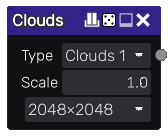

Clouds node
~~~~~~~~~~~

The **Clouds** node outputs various clouds noises.

Inputs
++++++

The **Clouds** node does not accept any input.

Outputs
+++++++

The **Clouds** node outputs a single greyscale texture of the noise.

Parameters
++++++++++

The **Clouds** node accepts the following parameters:

* *Type* defines the clouds type, three variations are available.

* *Scale* defines the scale of the output noise.

* *Resolution* defines the resolution of the output greyscale image.

Example images
++++++++++++++

