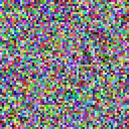

Color Noise node
~~~~~~~~~~~~~~~~

The **Color Noise** node outputs a randomly generated black and white texture.

.. image:: images/node_color_noise.png

Inputs
++++++

The **Color Noise** node does not accept any input.

Outputs
+++++++

The **Color Noise** node provides a black and white noise texture.

Parameters
++++++++++

The **Color Noise** node accepts the following parameters:

* *Grid size* is the number of rows and columns in the texture.

* *Density* is the likelihood for each cell to be white.

Notes
+++++

As with all random nodes, the seed is held by the node's position, so moving the node in the graph
will modify the texture, and the outputs will remain the same if its position and parameters
are not changed.

Although this node has a grid size, it generates a resolution independant texture.

Example images
++++++++++++++

