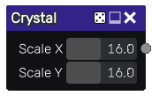

Crystal node
~~~~~~~~~~~~

The **Crystal** node outputs a crystal like pattern based on combining Voronoi noises.

Inputs
++++++

The **Crystal** noise node does not accept any input.

Outputs
+++++++

The **Crystal** noise node outputs a single greyscale texture of the crystal pattern.

Parameters
++++++++++

The **Crystal** noise node accepts the following parameters:

* *Scale X* and *Scale Y* define the number of feature points that define the noise.

Example images
++++++++++++++

