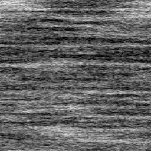

Directional Noise node
~~~~~~~~~~~~~~~~~~~~~~

The **Directional Noise** node outputs various directional noises.

.. image:: images/node_noise_directional_noise.png
	:align: center

Inputs
++++++

The **Directional Noise** node does not accept any input.

Outputs
+++++++

The **Directional Noise** node outputs a single greyscale texture of the noise.

Parameters
++++++++++

The **Directional Noise** node accepts the following parameters:

* *Type* defines the directional noise type, three variations are available.

* *Scale* defines the scale of the output noise.

* *Resolution* defines the resolution of the output greyscale image.

Example images
++++++++++++++

