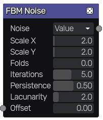
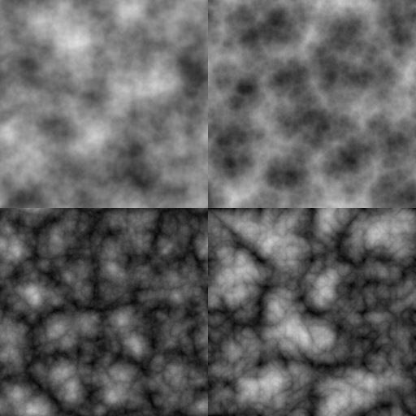

FBM node
~~~~~~~~

The **FBM** node outputs a fractional Brownian motion texture.
FBM is obtained by repeating a noise pattern with smaller and smaller details.

Inputs
++++++

The **FBM** node accepts a single input, the **Offset Input** to optionally
drive the **Offset** value with an input.

Outputs
+++++++

The **FBM** node provides a greyscale noise texture.

Parameters
++++++++++

The FBM node accepts the following parameters:

* the noise type: value, perlin, simplex, cellular types or voronoise noise
* the *X* and *Y* scale of the first octave noise
* the number of folds (offsetting the noise negatively and taking the absolute value)
* the number of iterations
* the persistance, i.e. the strength of each subsequent iteration
* the offset of the points, can be used to animate the noise

Example images
++++++++++++++

