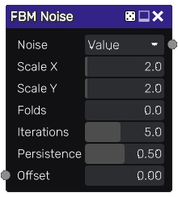

FBM node
~~~~~~~~

The **FBM** node outputs a fractional Brownian motion texture.
FBM is obtained by repeating a noise pattern with smaller and smaller details.

Inputs
++++++

The **FBM** node does not accept any input.

Outputs
+++++++

The **FBM** node provides a greyscale noise texture.

Parameters
++++++++++

The FBM node accepts the following parameters:

* the noise type: value, perlin, simplex or cellular noise
* the *X* and *Y* scale of the first octave noise
* the number of iterations
* the persistance, i.e. the strength of each subsequent iteration

Example images
++++++++++++++

