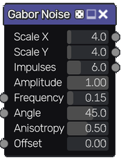
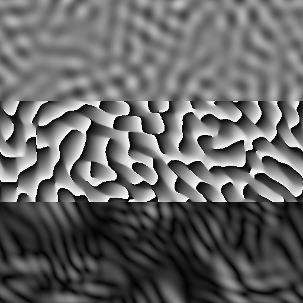

Gabor Noise node
~~~~~~~~~~~~~~~~

The **Gabor Noise** node outputs tileable gabor and phasor noise.

Inputs
++++++

The **Gabor Noise** node accepts three inputs:

* **Frequency Map** to optionally drive the **Frequency** value with an input.

* **Angle Map** to optionally drive the **Angle** value with an input.

* **Offset Map** to optionally drive the **Offset** value with an input.

Outputs
+++++++

The **Gabor Noise** node provides three outputs:

* Grayscale gabor noise texture.

* Grayscale image that shows the phasor component of the gabor noise.

* Grayscale image that shows the intensity component of the gabor noise.

Parameters
++++++++++

The Gabor Noise node accepts the following parameters:

* **X** and **Y** scale of the noise.

* Number of **Impulses** (noise density). Higher values may be computational intensive.

* **Amplitude** of the noise.

* **Frequency** of the noise.

* Directional **Angle** of the noise.

* **Anisotropy** (directional bias) of the noise.

* Phase **Offset** of the noise. Can be used to animate the noise(Gabor/Phasor outputs only).

Example images
++++++++++++++

