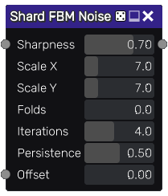

Shard FBM Noise node
~~~~~~~~~~~~~~~~~~~~

The **Shard FBM Noise** node outputs a fractional Brownian motion texture.
FBM is obtained by repeating a noise pattern with smaller and smaller details.

Inputs
++++++

The **Shard FBM Noise** node accepts two inputs, the **Offset Input** to optionally
drive the **Offset** value with an input and a *Sharpness Map* which affects the sharpness parameter.

Outputs
+++++++

The **Shard FBM Noise** node provides a greyscale noise texture.

Parameters
++++++++++

The Shard FBM Noise node accepts the following parameters:

* *Sharpness* of the noise
* *X* and *Y* scale of the first octave noise
* Number of folds (offsetting the noise negatively and taking the absolute value)
* Number of iterations
* Persistance, i.e. the strength of each subsequent iteration
* *Offset* of the points, can be used to animate the noise

Example images
++++++++++++++

