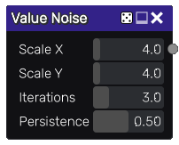

Value noise node
~~~~~~~~~~~~~~~~~

The **Value** noise node outputs a texture generated as a sum of Value noise functions
with increasing frequencies and decreasing amplitudes. Value noise has a wide range of
applications, such as stains, wood, dust...

Inputs
++++++

The **Value** noise node does not accept any input.

Outputs
+++++++

The **Value** noise node provides a greyscale Value noise texture.

Parameters
++++++++++

The **Value** noise node accepts the following parameters:

* *Scale X* and *Scale Y* are the subdivisions of the first iteration

* *Iterations* is the number of iterations

* *Persistance* is the ratio between the amplitude of subsequent iterations. Lower values
  of persistance generate smoother textures.

Notes
+++++

As with all random nodes, the seed is held by the node's position, so moving the node in the graph
will modify the texture, and the outputs will remain the same if its position and parameters
are not changed.

Example images
++++++++++++++

Variations
++++++++++

* The **Color Value** node generates an RGB image made of 3 greyscale Value Noise images.

* The **Value Warp1** and **Value Warp2** nodes generate Value noise with domain warping.

