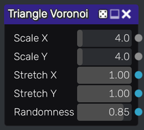
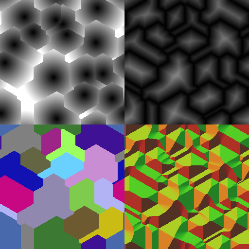

Triangle Voronoi noise node
~~~~~~~~~~~~~~~~~~~~~~~~~~~

The **Triangle Voronoi** node outputs Voronoi noise textures with triangle distance to cell borders

Inputs
++++++

The **Triangle Voronoi** noise node does not accept any input.

Outputs
+++++++

The **Triangle Voronoi** noise node provides five outputs:

* a grayscale Triangle Voronoi noise texture that shows the distance to the cell centers.

* a grayscale texture that shows the distance to the feature points.

* a color texture where each cell is filled with a random color.

* an UV map that maps each cell and can be used with the Custom UV node.

* a normal map to the cell borders.

Parameters
++++++++++

The **Triangle Voronoi** noise node accepts the following parameters:

* *Scale X* and *Scale Y* define the number of feature points that define the noise.

* *Stretch X* and *Stretch Y* are applied to the distance functions.

* *Randomness* defines the location of the feature points.

Example images
++++++++++++++

