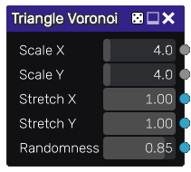

Triangle Voronoi noise node
~~~~~~~~~~~~~~~~~~~~~~~~~~~

The **Triangle Voronoi** node outputs Voronoi noise textures with triangle distance to cell borders

Inputs
++++++

The **Triangle Voronoi** noise node does not accept any input.

Outputs
+++++++

The **Triangle Voronoi** noise node provides three outputs:

* a grayscale texture that shows the distance to the feature points.

* a grayscale texture that shows the distance to the cell borders.

* fill information for each cell and must be connected to a Fill companion
  node, to generate random colors, custom UVs etc. to create complex materials that show
  for example cells of different colors.

Parameters
++++++++++

The **Triangle Voronoi** noise node accepts the following parameters:

* *Scale X* and *Scale Y* define the number of feature points that define the noise.

* *Stretch X* and *Stretch Y* are applied to the distance functions.

* *Randomness* defines the location of the feature points.

Example images
++++++++++++++

.. image:: images/node_voronoi_triangle_samples.png
	:align: center
