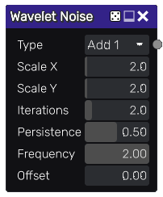

Wavelet noise node
~~~~~~~~~~~~~~~~~~

The **Wavelet noise** node outputs a texture generated repetition of a wavelet pattern.

Inputs
++++++

The **Wavelet noise** node does not accept any input.

Outputs
+++++++

The **Wavelet noise** node provides a grayscale Wavelet noise texture.

Parameters
++++++++++

The **Wavelet noise** node accepts the following parameters:

* *Type* defines how octaves are calculated

* *Scale X* and *Scale Y* are the subdivisions of the noise

* *Iterations* is the number of iterations

* *Persistence* is the strength of each subsequent iteration

* *Frequency* is the frequency of each wavelet pattern

* *Offset* is the phase of each wavelet pattern 

Example images
++++++++++++++

