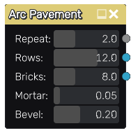
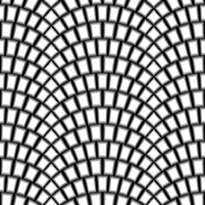

Arc Pavement node
~~~~~~~~~~~~~~~~~

The **Arc Pavement** node outputs several related bricks pattern textures that can be used for pavement.

Inputs
++++++

The **Arc Pavement** node does not accept any input map.

Outputs
+++++++

The **Arc Pavement** node provides the following textures:

* The first one is a greyscale image where bricks are shown in white and mortar in black.

* The second one is a color image where all bricks are drawn using a random uniform color.

* The 3rd texture is an UV map texture for each brick (and can be used with the **CustomUV**
  node to apply a texture on each brick)

Those images can be used together to create complex materials that show for example tiles
of different colors.

Parameters
++++++++++

The **Arc Pavement** node accepts the following parameters:

* the *Repeat* parameter defines the number of patterns on the horizontal axe of the texture.

* the *Rows* parameter defines the number of brick rows in a single pattern of the texture.

* the *Bricks* parameter defines the number of bricks in a single row of the texture.

* the *Mortar* parameter defines the relative thickness of mortar in patterns.

* the *Bevel* parameter defines the relative thickness of brick bevel in patterns.

Example images
++++++++++++++

