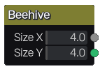
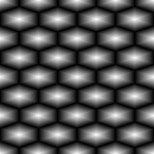

Beehive node
~~~~~~~~~~~~

The **Beehive** node outputs a hexagon grid pattern.

Inputs
++++++

The **Beehive** node does not accept any input.

Outputs
+++++++

The **Beehive** generates:

* a greyscale output texture

* a color texture where each tile is filled with a random color

* an UV map that maps each hexagon and that can be used with the CustomUV node

Parameters
++++++++++

The **Beehive** node accepts the following parameters:

* the *Size X* and *Size Y* parameters define the number of patterns in the output texture.

Example images
++++++++++++++

