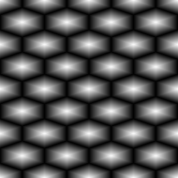

Beehive node
~~~~~~~~~~~~

The **Beehive** node outputs a hexagon grid pattern.

.. image:: images/node_pattern_beehive.png
	:align: center

Inputs
++++++

The **Beehive** node does not accept any input.

Outputs
+++++++

The **Beehive** generates:

* a greyscale output texture

* Fill information for each hexagon that must be connected to a Fill companion node

The second output can be used in conjunction with **Fill To** nodes to generate random colors,
custom UVs etc. to create complex materials that show for example bricks of different colors.

Parameters
++++++++++

The **Beehive** node accepts the following parameters:

* the *Size X* and *Size Y* parameters define the number of patterns in the output texture.

Example images
++++++++++++++

