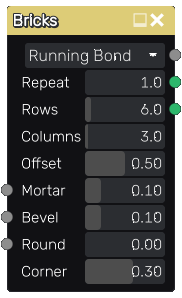

Bricks node
~~~~~~~~~~~

The **Bricks** node outputs several related bricks pattern textures that can be used for walls
or pavement.

Inputs
++++++

The **Bricks** node accepts 3 optional greyscale input maps for the shape mortar,
bevel and round parameters (the corresponding parameter is multiplied by the map value).

Outputs
+++++++

The **Bricks** node provides the following textures:

* The first is a greyscale image where bricks are shown in white and mortar in black.

* The second is an RGBA texture that contains the bounding box for each brick.

* The third is an RGBA texture that contains the bounding box for each brick corner.

The bounding box textures can be used in conjunction with **Fill To** nodes to generate random colors,
custom UVs etc. to create complex materials that show for example bricks of different colors.

Parameters
++++++++++

The **Bricks** node accepts the following parameters:

* the *Pattern* parameter defines the bricks pattern that will be generated.

* the *Repeat* parameter defines the number of patterns on the horizontal and vertical
  axes of the texture.

* the *Rows* parameter defines the number of brick rows in a single pattern of the texture.

* the *Columns* parameter defines the number of brick rows in a single pattern of the texture.

* the *Offset* parameter defines the offset of odd rows of the pattern. This parameter
  only applies to the *Running bond* patterns.

* the *Mortar* parameter defines the relative thickness of mortar in patterns.

* the *Bevel* parameter defines the relative thickness of brick bevel in patterns.

* the *Round* parameter defines the radius of each round corner.

* the *Corner* parameter defines the size of each corner (for the 3rd output texture).

Example images
++++++++++++++

.. image:: images/node_bricks_samples.png
	:align: center
