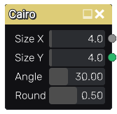

Cairo node
~~~~~~~~~~

The **Cairo** node outputs a cairo pattern.

Inputs
++++++

The **Cairo** node does not accept any input.

Outputs
+++++++

The **Cairo** generates a greyscale heightmap for the pattern as well as Fill information
for each tile.

Parameters
++++++++++

The **Cairo** node accepts the following parameters:

* the *Size X* and *Size Y* parameters define the number of patterns that will be generated.

* the *Angle* parameter defines the pentagonal shapes that form the pattern. 

* the *Round* parameter can be used to create round corners.

Example images
++++++++++++++

