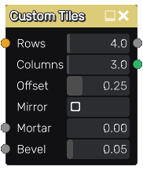

Custom Tiles node
~~~~~~~~~~~~~~~~~

The **Custom Tiles** node outputs a custom tiles pattern, whose shape is defined by an SDF input.

Inputs
++++++

The **Custom Tiles** node accepts an SDF input that describes the shape of a tile
as well as 2 optional grayscale input maps for the shape mortar and bevel
parameters (the corresponding parameter is multiplied by the map value).

Outputs
+++++++

The **Custom Tiles** node provides the following textures:

* The first is a grayscale image where Tiles are shown in white and mortar in black.

* The second is Fill information for each brick and must be connected to a Fill companion
  node, to generate random colors, custom UVs etc. to create complex materials that show
  for example tiles of different colors.

Parameters
++++++++++

The **Custom Tiles** node accepts the following parameters:

* the *Rows* parameter defines the number of tile rows in a single pattern of the texture.

* the *Columns* parameter defines the number of tile rows in a single pattern of the texture.

* the *Offset* parameter defines the offset of each row of the pattern relative to the row above.

* the *Mirror* parameter can be used to mirror every other row.

* the *Mortar* parameter defines the relative thickness of mortar in patterns.

* the *Bevel* parameter defines the relative thickness of brick bevel in patterns.

Example images
++++++++++++++

