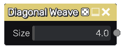

Diagonal Weave node
~~~~~~~~~~~~~~~~~~~

The **Diagonal Weave** node outputs a weaving pipes pattern.

Inputs
++++++

The **Diagonal Weave** node does not accept any input.

Outputs
+++++++

The **Diagonal Weave** generates a single greyscale output texture.

Parameters
++++++++++

The **Diagonal Weave** node accepts the following parameters:

* the *Size* parameter is the number of tiles (on both axes) in the generated image. 

Example images
++++++++++++++

The following sample shows a diagonal weave pattern filtered using a colorize node.

