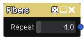

Fibers node
~~~~~~~~~~~

The **Fibers** node outputs a fibers pattern, that can be used for cloth.

Inputs
++++++

The **Fibers** node does not accept any input.

Outputs
+++++++

The **Fibers** node generates a single grayscale output texture.

Parameters
++++++++++

The **Fibers** node accepts the following parameters:

* the *Repeat* parameter defines the number of patterns in the output texture. 

Example images
++++++++++++++

