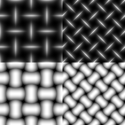

Mesh node
~~~~~~~~~~~

The **Mesh** node outputs a mesh pattern.

Inputs
++++++

The **Mesh** node accepts the single input *Custom Shape* for an optional custom shape, to use with the *Input* option in the *Shape* selector.

Outputs
+++++++

The **Mesh** node provides the following textures:

* the *Patern* outputs the mesh heightmap.
* the *Horizontal Mask* outputs a mask of the horizontal shapes.
* the *Vertical Mask* outputs a mask of the vertical shapes.

Parameters
++++++++++

The **Mesh** node accepts the following parameters:

* the *Shape* parameter defines the shape used for the mesh, including the *Input* option which uses the "Custom Shape" input as the shape.
* the *Tiling* parameter defines the number of patterns in the output texture. 
* the *Diagonal* parameter rotates the pattern 45 degrees while preserving tiling.

Example images
++++++++++++++

