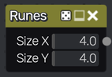
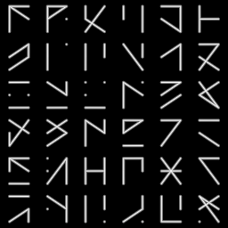

Runes node
~~~~~~~~~~

The **Runes** node outputs a runes pattern.

It is based on code written by Otavio Good (https://www.shadertoy.com/view/MsXSRn).

Inputs
++++++

The **Runes** node does not accept any input.

Outputs
+++++++

The **Runes** generates a single grayscale output texture.

Parameters
++++++++++

The **Runes** node accepts the following parameters:

* the *Size X* and *Size Y* parameters define the number of patterns in the output texture.

Example images
++++++++++++++

