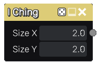

I Ching node
~~~~~~~~~~~~

The **I Ching** node outputs a pattern made of random hexagrams.

Inputs
++++++

The **I Ching** node does not accept any input.

Outputs
+++++++

The **I Ching** generates a single grayscale output texture.

Parameters
++++++++++

The **I Ching** node accepts the following parameters:

* the *Size X* and *Size Y* parameters define the number of hexagrams in the output texture.

Example images
++++++++++++++

.. image:: images/node_iching_samples.png
	:align: center
