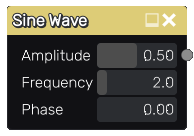

Sine Wave node
~~~~~~~~~~~~~~

The **Sine Wave** node outputs a greyscale sine function graph.

Inputs
++++++

The **Sine Wave** node does not accept any input.

Outputs
+++++++

The **Sine Wave** generates a single greyscale output texture.

Parameters
++++++++++

The **Sine Wave** node accepts the *amplitude*, the *frequency*
and the *phase* of the sine wave as a pattern. 

Example images
++++++++++++++

