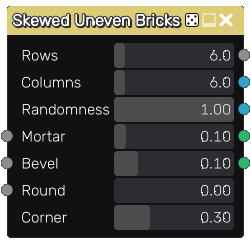

Skewed Uneven Bricks node
~~~~~~~~~~~~~~~~~~~~~~~~~

The **Skewed Uneven Bricks** node outputs an uneven brick pattern texture that can be used for walls
or pavement. This node is similar to the **Uneven Bricks 3** node, but generates skewed bricks by 
using randomly angled intersections.

Inputs
++++++

The **Skewed Uneven Bricks** node accepts 3 optional greyscale input maps for the shape mortar,
bevel and round parameters (the corresponding parameter is multiplied by the map value).

Outputs
+++++++

The **Skewed Uneven Bricks** node provides the following textures:

* The first is a greyscale image where bricks are shown in white and mortar in black.

* The second is an RGB output of the skewed uv islands of each brick.

* The third is an RGB output of the skewed uv islands of the four corners of each brick.

* The fourth is Fill information for each brick and must be connected to a Fill companion node.

* The fifth is Fill information for each brick corner and must be connected to a Fill companion node.

The fourth and fifth outputs can be used in conjunction with **Fill To** nodes to generate random colors,
custom UVs etc. to create complex materials that show for example bricks of different colors.

Parameters
++++++++++

The **Skewed Uneven Bricks** node accepts the following parameters:

* the *Rows* parameter defines the number of brick rows in a single pattern of the texture.

* the *Columns* parameter defines the number of brick rows in a single pattern of the texture.

* the *Randomness* parameter defines the randomness introduced when generating the pattern.

* the *Mortar* parameter defines the relative thickness of mortar in patterns.

* the *Bevel* parameter defines the relative thickness of brick bevel in patterns.

* the *Round* parameter defines the radius of each round corner.

* the *Corner* parameter defines the size of each corner (for the 3rd and 5th output texture).

Example images
++++++++++++++

