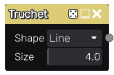

Truchet node
~~~~~~~~~~~~

The **Truchet** node outputs a truchet pattern.

Inputs
++++++

The **Truchet** node does not accept any input.

Outputs
+++++++

The **Truchet** generates a single greyscale output texture.

Parameters
++++++++++

The **Truchet** node accepts the following parameters:

* the *Shape* parameter (line or circle) defines the edges of the truchet pattern.

* the *Size* parameter is the number of patterns (on both axes) in the generated image. 

Notes
+++++

As with all random nodes, the seed is held by the node's position, so moving the node in the graph
will modify the texture, and the outputs will remain the same if its position and parameters
are not changed.

Example images
++++++++++++++

Both bottom samples show a truchet pattern filtered using a colorize node.

.. image:: images/node_truchet_samples.png
	:align: center
