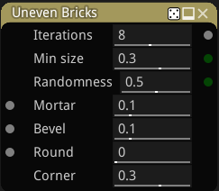
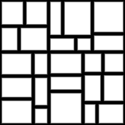

Uneven Bricks node
~~~~~~~~~~~~~~~~~~

The **Uneven Bricks** node outputs several related bricks pattern textures that can be used for walls
or pavement. It generates an uneven pattern by randomly splitting bricks.

Inputs
++++++

The **Uneven Bricks** node accepts 3 optional greyscale input maps for the shape mortar,
bevel and round parameters (the corresponding parameter is multiplied by the map value).

Outputs
+++++++

The **Uneven Bricks** node provides the following textures:

* The first one is a greyscale image where bricks are shown in white and mortar in black.

* The second one is a color image where all bricks are drawn using a random uniform color.

* The 3rd and 4th textures are greyscale images of the X and Y position of the center of
  each brick.

* The 5th texture is an UV map texture for each brick (and can be used with the **CustomUV**
  node to apply a texture on each brick)

* the 6th texture is an UV map for each corner of each brick (and can be used with the
  **CustomUV** node to apply a texture on each corner)

Those images can be used together to create complex materials that show for example bricks
of different colors.

Parameters
++++++++++

The **Uneven Bricks** node accepts the following parameters:

* the *Iterations* parameter defines number of brick split iterations.

* the *Min size* parameter defines the minimum size of a brick.

* the *Randomness* parameter defines the randomness introduced when generating the pattern.

* the *Columns* parameter defines the number of brick rows in a single pattern of the texture.

* the *Offset* parameter defines the offset of odd rows of the pattern. This parameter
  only applies to the *Running bond* patterns.

* the *Mortar* parameter defines the relative thickness of mortar in patterns.

* the *Bevel* parameter defines the relative thickness of brick bevel in patterns.

* the *Round* parameter defines the radius of each round corner.

* the *Corner* parameter defines the size of each corner (for the 6th output texture).

Example images
++++++++++++++

