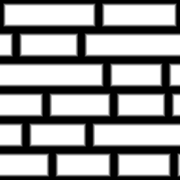

Uneven Bricks 2 node
~~~~~~~~~~~~~~~~~~~~

The **Uneven Bricks 2** node outputs an uneven brick pattern texture that can be used for walls
or pavement. It generates an uneven pattern by randomly splitting rows of bricks horizontally.

.. image:: images/node_pattern_unevenbricks2.png
	:align: center

Inputs
++++++

The **Uneven Bricks 2** node accepts 3 optional greyscale input maps for the shape mortar,
bevel and round parameters (the corresponding parameter is multiplied by the map value).

Outputs
+++++++

The **Uneven Bricks 2** node provides the following textures:

* The first is a greyscale image where bricks are shown in white and mortar in black.

* The second is an RGBA texture that contains the bounding box for each brick.

* The 3rd is an RGBA texture that contains the bounding box for each brick corner.

The bounding box textures can be used in conjunction with **Fill To** nodes to generate random colors,
custom UVs etc. to create complex materials that show for example bricks of different colors.

Parameters
++++++++++

The **Uneven Bricks 2** node accepts the following parameters:

* the *Rows* parameter defines the number of brick rows in a single pattern of the texture.

* the *Iterations* parameter defines number of brick split iterations.

* the *Min size* parameter defines the minimum size of a brick.

* the *Mortar* parameter defines the relative thickness of mortar in patterns.

* the *Bevel* parameter defines the relative thickness of brick bevel in patterns.

* the *Round* parameter defines the radius of each round corner.

* the *Corner* parameter defines the size of each corner (for the 3rd output texture).

Example images
++++++++++++++

