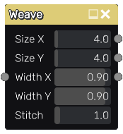
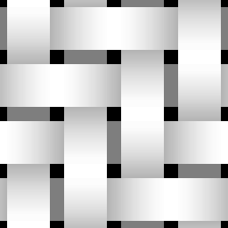

Weave node
~~~~~~~~~~

The **Weave** node outputs a weave pattern, that can be used for cloth.

Inputs
++++++

The **Weave** node accepts an optional grayscale input map for the width parameter
(whose value is multiplied by the map value).

Outputs
+++++++

The **Weave** generates a grayscale heightmap for the pattern as well as masks
for the horizontal and vertical stripes.

Parameters
++++++++++

The **Weave** node accepts the following parameters:

* the *Size X* and *Size Y* parameters define the number of patterns that will be generated.

* the *Width X* and *Width Y* parameters define the width of stitches. 

* the *Stitch* parameter sets the length of the stitch.

Example images
++++++++++++++

