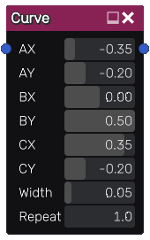

Curve node
~~~~~~~~~~

The **Curve** node outputs a simple RGBA image showing a bezier curve defined by 3 control points.

Inputs
++++++

The Curve node accepts an optional image that is mapped along the curve.

Outputs
+++++++

The Curve node generates an RGBA image showing the bezier curve.

Parameters
++++++++++

The **Curve** node has the following parameters:

* the coordinates of the control points
* the *width* of the curve to be drawn
* the number of repetitions of the input pattern along the curve

Example images
++++++++++++++

