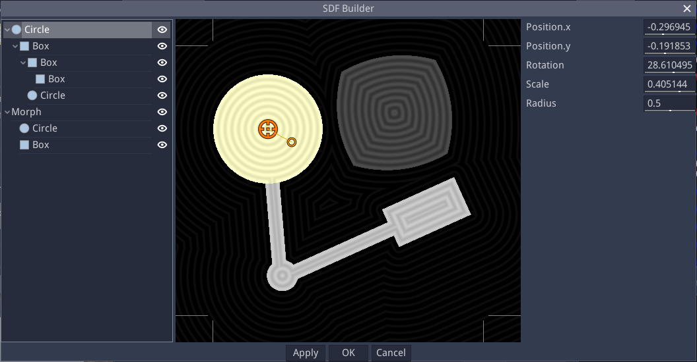
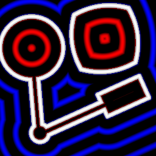

Easy SDF node
~~~~~~~~~~~~~

The **Easy SDF** node outputs a custom 2D or 3D SDF shape that can be defined using a simple editor.

Inputs
++++++

The Easy SDF node does not have any input.

Outputs
+++++++

The Easy SDF node generates a Signed Distance Function output for a 2D or 3D shape,
as well as Albedo, Metallic, Roughness and Emission maps.

Parameters
++++++++++

The **Easy SDF** node has no parameter by default.

Node parameters can be defined in the editor.

Editor
++++++

Double-clicking an Easy SDF node will show the SDF Builder window.

This window consists of (from left to right) a treeview of the SDF shape, a preview, and a parameter panel.

Treeview
--------

The treeview shows all items of the SDF shape in a hierarchy. Items can be added, copied, pasted or deleted
using the context menu.

The available SDF item types are:

* For 2D:

  * Shapes: Circle, Ellipse, NGon, Star, Isoceles triangle, Rhombus, Line, Tunnel, Stairs
  * Boolean operations:

    * Union joins its children into a single shape
    * Intersection intersects its children
    * Difference removes all subsequent children from the first
    * Smooth union and smooth intersection are smooth variations of union and intersection

  * Alter operations that are applied to their children:

    * Flip, mirror or elongate along X and/or Y axis
    * Round by dilating Shapes
    * Bend
    * Annular
    * Morph between 2 children shapes

* For 3D:

  * Shapes: Sphere, Box, Cylinder, Capsule, Pyramid, Ellipsoid, Octahedron
  * Revolution and Extrusion (that accept 2D SDF as children)
  * Boolean operations:

    * Union joins its children into a single shape
    * Intersection intersects its children
    * Difference removes all subsequent children from the first
    * Smooth union and smooth intersection are smooth variations of union and intersection

  * Alter operations that are applied to their children:

    * Flip, mirror or elongate along X and/or Y axis
    * Round by dilating Shapes
    * Bend
    * Annular
    * Morph between 2 children shapes

All item types have builtin translate, rotate and scale operations.
Unless specified otherwise, all items apply a union operation to their children.

* For both 2D and 3D items, Coloring items can be added, and define the corresponding
  channel for their parent:

  * Albedo
  * Metallic
  * Roughness
  * Emission

  Coloring items generally apply to their parent item, except for smooth unions
  that only take their children colors into account (and blend them according to
  their ColorK parameter).

* Those Coloring items can contain Texturing items:

  * Uniform: a uniform color
  * SimpleGradient: Create a gradient between 2 colors (defined as parameters) following
    its greyscale child texture
  * Pattern: A greyscale pattern similar to the Pattern node
  * FBM: A greyscale noise similar to the FBM node

Preview
-------

The 2D preview shows the generated shape for the whole tree in grey, and highlights the
selected subtree in light grey and the selected item without alterations in light yellow.
It has several view modes:

* a mode that shows the SDF and Albedo coloring
* a mode that shows the SDF only
* a mode that shows the Albedo coloring
* a mode that shows the Metallic coloring
* a mode that shows the Roughness coloring
* a mode that shows the Emission coloring

The 3D preview shows the generated shape for the whole tree.

Controls for position, scale, rotation angle and item-specific parameters are shown in the
preview and can be used to modify the selected item's parameters.

Parameters
----------

The Parameters panel has 2 sections, Node Parameters, and Item Parameters.

The Node Parameters must be declared and can be used in Item Parameters
expressions. A new node parameter can be created by clicking the "+"
button. Its name can be modified directly in the corresponding text
entry, its label and description can be edited by using the "yellow page"
button, and its bounds and editing step can be set using the pencil button.
It can also be deleted using the red cross button or moved in the list with
the arrow buttons.

The Item Parameters section shows the parameters of the currently selected
item. They are predefined for each item type, and float parameters have an
extra "expression" button, that can be used to define an expression that
uses Node Parameters.

Regarding parameters, there are 2 modes in the editor, and clicking either
Node Parameters or Item Parameters checkbox will switch:

* In Item Parameters mode (enabled by default), Node Parameters are not taken
  into account, and the values of Item Parameters can be edited. Parameter
  expressions and Node Parameters can be edited, but doing so will not update
  the preview.
  This mode can be used to edit a default pose for the shapes.

* In Node Parameters mode, Item Parameters will be read-only (and the corresponding)
  gizmos in the preview will be hidden, parameter expressions will be applied when
  defined.
  This mode is useful to tweak expressions and default values for the Node
  Parameters.

Example images
++++++++++++++

