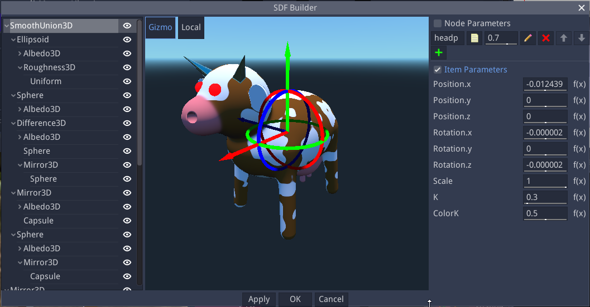
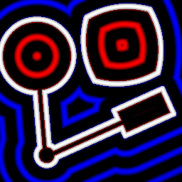

EasySDF node
~~~~~~~~~~~~

The **EasySDF** node outputs a custom 2D SDF shape that can be defined using a simple editor.

Inputs
++++++

The EasySDF node does not have any input.

Outputs
+++++++

The EasySDF node generates a single 2D Signed Distance Function output.

Parameters
++++++++++

The **EasySDF** node has no parameter.

Editor
++++++

Double-clicking an EasySDF node will show the SDF Builder window.

This window consists of (from left to right) a treeview of the SDF shape, a preview, and a parameter panel.

Treeview
--------

The treeview shows all items of the SDF shape in a hierarchy. Items can be added, copied, pasted or deleted
using the context menu.

The available item types are:

* Shapes: Circle, Elllipse, NGon, Star, Isoceles triangle, Rhombus, Line, Tunnel, Stairs
* Boolean operations:

  * Union joins its children into a single shape
  * Intersection intersects its children
  * Difference removes all subsequent children from the first
  * Smooth union and smooth intersection are smooth variations of union and intersection

* Alter operations that are applied to their children:

  * Flip, mirror or elongate along X and/or Y axis
  * Round by dilating Shapes
  * Bend
  * Annular
  * Morph between 2 children shapes

All item types have builtin translate, rotate and scale operations.
Unless specified otherwise, all items apply a union operation to their children.

Preview
-------

The preview shows the generated shape for the whole tree in grey, and highlights the
selected subtree in light grey and the selected item without alterations in light yellow.

Controls for position, scale, rotation angle an item-specific parameters are shown in the
preview and can be used to modify the selected item's parameters.

Parameters
----------

The Parameters panel can be used to modify the selected items parameters.

Example images
++++++++++++++

