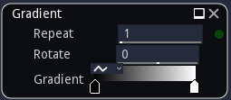
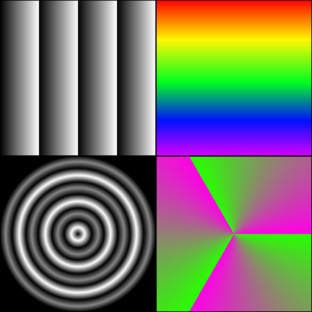

Gradient nodes
~~~~~~~~~~~~~~

The **Gradient**, **Circular Gradient**, **Spiral Gradient** and **Radial Gradient** nodes generate
a color, user defined gradient.

Inputs
++++++

The gradient nodes do not accept any input.

Outputs
+++++++

The gradient nodes generate a single color gradient image.

Parameters
++++++++++

The **Gradient** nodes accept the following parameters:

* **Number of repetitions** of the gradient

* **Rotation angle** (only for the linear **Gradient** node)

* **Perspective effect** (only for the spiral **Gradient** node)

* **Zoom** (only for the spiral **Gradient** node)

* **Mirror** which mirrors the **Gradient**

* The **Gradient**

Example images
++++++++++++++

