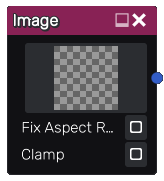

Image node
~~~~~~~~~~

The image node outputs a single texture based on an image file.

Inputs
++++++

The image node does not accept any input.

Outputs
+++++++

The image node provides a single color texture.

Parameters
++++++++++

The **Image** node has three parameters:

* The first parameter defines the image file the node provides.
  It can be modified by clicking the thumbnail and selecting a new image file.
* **Fix Aspect Ratio** will scale the height of non-square images to maintain the correct aspect ratio.
* **Clamp** will disable the default tiling behavior.
  Useful when dealing with non-square images as they cannot easily be clamped further down the graph.

The supported formats are BMP, EXR, HDR, JPEG, PNG, SVG, TGA, WebP and DDS.
