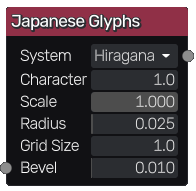
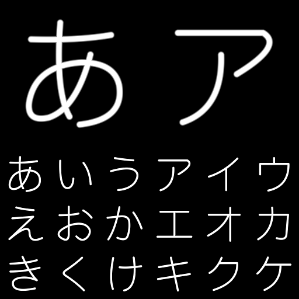

Japanese glyphs node
~~~~~~~~~~~~~~~~~~~~

The **Japanese glyphs** node outputs Japanese Hiragana/Katakana glyph(s)

Inputs
++++++

The **Japanese glyphs** node accepts an optional bevel map, which the parameter is multiplied by the map value.

Outputs
+++++++

The **Japanese glyphs** node outputs a greyscale texture.

Parameters
++++++++++

The **Japanese glyphs** node accepts the following parameters:

* The *System* parameter, which can be one of the two writing systems: *Hiragana*, *Katakana*

* The *Character* specifies the Japanese glyph to display.

* The *Scale* parameter specifies the scale of the glyph(s).

* The *Radius* parameter controls the thickness of the glyph(s).

* The *Grid Size* parameter controls the number of columns/rows of the grid.

* the *Bevel* parameter controls the width of the edge of the glyph(s).

Example images
++++++++++++++

