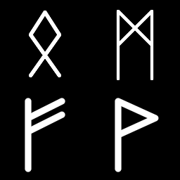

Nordic Runes node
~~~~~~~~~~~~~~~~~

The **Nordic Runes** node outputs nordic(i.e. Elder Futhark) glyphs

.. image:: images/node_simple_nordic_runes.png
	:align: center

Inputs
++++++

The **Nordic Runes** node accepts an optional bevel map, which the parameter is multiplied by the map value.

Outputs
+++++++

The **Nordic Runes** node outputs a greyscale texture.

Parameters
++++++++++

The **Nordic Runes** node accepts the following parameters:

* The *Rune* specifies the rune to display.

* The *Width* parameter specifies the width of the rune.

* The *Height* parameter specifies the height of the rune.

* The *Scale* parameter specifies the scale of the rune.

* The *Radius* parameter controls the thickness of the rune.

* The *Bevel* parameter controls the width of the edge of the rune.

Example images
++++++++++++++

