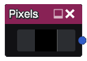
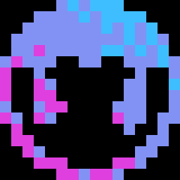

Pixels node
~~~~~~~~~~~

The **Pixels** node outputs a pixelated image that can be created with a simple pixel art editor

Inputs
++++++

The Pixels node does not have any input.

Outputs
+++++++

The Pixels node will output the pixel art created in the built-in editor.

Additionally, there's a Pixels/Smooth variation that will output a smoothed version of the created pixel art.

Parameters
++++++++++

In Pixels built-in editor the following parameters are available:

 - *Width* and *Height* of the created pixel art
 - *Bits Per Pixel*, which defines how many colors are available for painting

Editor
++++++

Clicking on the options button will show the Width/Height and Bits parameters available

Left-clicking on a color will select it for painting, and Right-clicking will open up the color swatch to change colors

Example images
++++++++++++++

