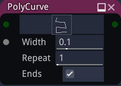
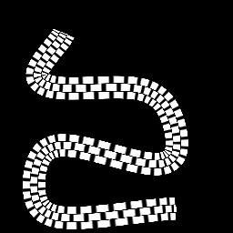

Poly Curve node
~~~~~~~~~~~~~~~

The **Poly Curve** node outputs a simple RGBA image showing a curve defined by several control points.

Inputs
++++++

The Poly Curve node accepts an optional image that is mapped along the curve,
and an optional profile that can be generated using a Tonality node.

Outputs
+++++++

The Poly Curve node generates an RGBA image showing the curve.

Parameters
++++++++++

The **Poly Curve** node has the following parameters:

* the control points that define the polycurve
* the *width* of the curve to be drawn
* the number of repetitions of the input pattern along the curve

Example images
++++++++++++++

