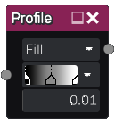

Profile node
~~~~~~~~~~~~

The **Profile** is an utility node that outputs a simple grayscale image showing
the profile of a gradient interpreted as grayscale.

Inputs
++++++

The Profile node does not accept any input.

Outputs
+++++++

The Profile node generates a grayscale image showing the profile of the specified gradient.

Parameters
++++++++++

The **Profile** node has the following parameters:

* the drawing mode of the profile: *fill* will fill the lower part of the
  curve and *curve* just draws the curve 
* the gradient whose profile is shown
* the *width* of the Profile to be drawn

Notes
+++++

The main purpose of this node is to visualize gradients to be used in other nodes
to create depth or normal maps. The gradient can easily be copied to a **Gradient** or
**Colorize** node using drag and drop.

Example images
++++++++++++++

